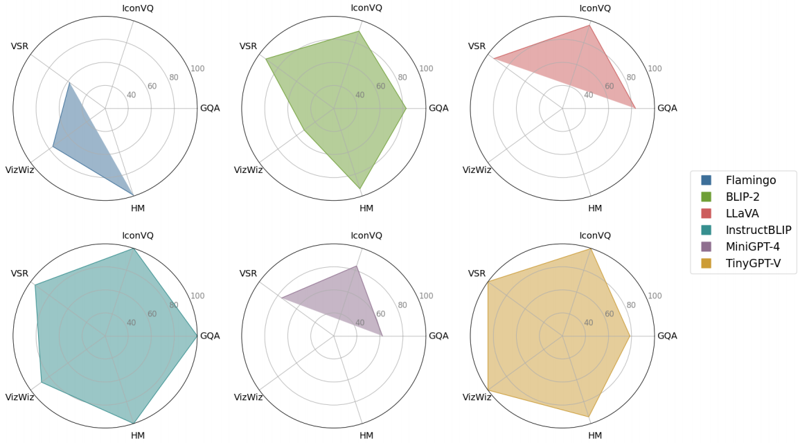

# TinyGPT-V

<font size='5'>**TinyGPT-V: Efficient Multimodal Large Language Model via Small Backbones**</font>

Zhengqing Yuan❁, Zhaoxu Li❁, Lichao Sun❋

❁Visiting Students at LAIR Lab, Lehigh University
❋Lehigh University

</a> <a href='https://arxiv.org/abs/2312.16862'></a>  <a href='https://huggingface.co/Tyrannosaurus/TinyGPT-V'></a> <a href='https://huggingface.co/spaces/llizhx/TinyGPT-V'> 


</font>

## News
[Jan.03 2024] Welcome to Hugging Face online demo to try out our models (for Stage-3)!

[Dec.28 2023] Breaking! We release the code of our TinyGPT-V.

## TinyGPT-V Traning Process


## TinyGPT-V Model Structure


## TinyGPT-V Results



## Getting Started
### Installation

**1. Prepare the code and the environment**

Git clone our repository, creating a python environment and activate it via the following command

```bash
git clone https://github.com/DLYuanGod/TinyGPT-V.git
cd TinyGPT-V
conda env create -f environment.yml
conda activate tinygptv
```


**2. Prepare the pretrained LLM weights**

**TinyGPT-V** is based on Phi-2. 
Download the corresponding LLM weights from the following huggingface space via clone the repository using git-lfs.

Phi-2 2.7B: [Download](https://huggingface.co/susnato/phi-2)


Then, set the variable *phi_model* in the model config file to the LLM weight path.

* Set the LLM path [here](minigpt4/configs/models/minigpt_v2.yaml#L14) at Line 14, [here](minigpt4/configs/models/minigpt4_vicuna0.yaml#L18) at Line 18 and [here](minigpt4/conversation/conversation.py#L16).


**3. Prepare the pretrained model checkpoints**

Download the pretrained model checkpoints


| After stage-1 | After stage-2 | After stage-3| After stage-4 | 
| ------ | ------ | ------ | -------|
| [Download](https://huggingface.co/Tyrannosaurus/TinyGPT-V/blob/main/TinyGPT-V_for_Stage1.pth) |[Download](https://huggingface.co/Tyrannosaurus/TinyGPT-V/blob/main/TinyGPT-V_for_Stage2.pth) | [Download](https://huggingface.co/Tyrannosaurus/TinyGPT-V/blob/main/TinyGPT-V_for_Stage3.pth) |[Download](https://huggingface.co/Tyrannosaurus/TinyGPT-V/blob/main/TinyGPT-V_for_Stage4.pth) |


For **TinyGPT-V**, set the path to the pretrained checkpoint in the evaluation config file 
in [tinygptv_stage1_2_3_eval.yaml](eval_configs/tinygptv_stage1_2_3_eval.yaml#L8) at Line 8 for Stage 1, 2 and 3 version or [tinygptv_stage4_eval.yaml](eval_configs/tinygptv_stage4_eval.yaml#L8) for Stage 4 version.   


**4. Update the Phi-2 Modeling for transformers lib.**

Linux system:

```
cp modeling_phi.py /root/miniconda3/envs/tinygptv/lib/python3.9/site-packages/transformers/models/phi/
```

Windows system 

Find your conda yourself: conda_sit/envs/tinygptv/lib/python3.9/site-packages/transformers/models/phi/ Replace modeling_phi.py in that directory with the one in TinyGPT-V/modeling_phi.py.


### Launching Demo Locally

For Stage 4, run

```
python demo_v2.py --cfg-path eval_configs/tinygptv_stage4_eval.yaml  --gpu-id 0
```

For Stage 1, 2 and 3, run

```
python demo.py --cfg-path eval_configs/tinygptv_stage1_2_3_eval.yaml  --gpu-id 0
```


To perfer more powerful model, LLMs loads as 16 bit by default. This configuration requires about 8G GPU memory. 
To more save GPU memory, you can run the model
in 8 bit below 8G device by setting `low_resource` to `True` in the relevant config file:

* Stage 4 [tinygptv_stage4_eval.yaml](eval_configs/tinygptv_stage4_eval.yaml#6) 

* Stage 1, 2 and 3 [tinygptv_stage1_2_3_eval.yaml](eval_configs/tinygptv_stage1_2_3_eval.yaml#6) 


```diff
-Note: Stage 4 is currently a test version as it utilizes partial data for traing. Please use Stage 3 for the demo.
```

### Training

First you need to adjust all the updated weights in the LLM to be calculated with full precision:[Here](minigpt4\models\base_model.py). Remove the comments from the following lines:

```
                layer.self_attn.q_layernorm.weight.data = layer.self_attn.q_layernorm.weight.data.float()
                layer.self_attn.k_layernorm.weight.data = layer.self_attn.k_layernorm.weight.data.float()
                layer.post_layernorm.weight.data = layer.post_layernorm.weight.data.float()
                layer.input_layernorm.weight.data = layer.input_layernorm.weight.data.float()

                # Perform a similar operation for the bias item
                if layer.self_attn.q_layernorm.bias is not None:
                    layer.self_attn.q_layernorm.bias.data = layer.self_attn.q_layernorm.bias.data.float()
                if layer.self_attn.k_layernorm.bias is not None:
                    layer.self_attn.k_layernorm.bias.data = layer.self_attn.k_layernorm.bias.data.float()
                if layer.input_layernorm.bias is not None:
                    layer.input_layernorm.bias.data = layer.input_layernorm.bias.data.float()


            llama_model.model.model.final_layernorm.weight.requires_grad = True
            llama_model.model.model.final_layernorm.weight.data = llama_model.model.model.final_layernorm.weight.data.float()
            if llama_model.model.model.final_layernorm.bias is not None:
                llama_model.model.model.final_layernorm.bias.data = llama_model.model.model.final_layernorm.bias.float()
```

**Stage 1 and 2:**

* Datasets: [first stage dataset preparation instruction](https://github.com/Vision-CAIR/MiniGPT-4/blob/main/dataset/README_1_STAGE.md)

* Then run:
```
torchrun --nproc-per-node NUM_GPU train.py --cfg-path train_configs/tinygptv_stage1.yaml
```
You need to execute the above code 17 times to complete the first stage of training.

* Then run:
```
torchrun --nproc-per-node NUM_GPU train.py --cfg-path train_configs/tinygptv_stage2.yaml
```

**Stage 3:**

* Datasets: [stage 3 dataset preparation instruction](https://github.com/Vision-CAIR/MiniGPT-4/blob/main/dataset/README_2_STAGE.md)

* Then run:
```
torchrun --nproc-per-node NUM_GPU train.py --cfg-path train_configs/tinygptv_stage3.yaml
```

**Stage 4:**

* Datasets: [stage 4 dataset preparation instruction](https://github.com/Vision-CAIR/MiniGPT-4/blob/main/dataset/README_MINIGPTv2_FINETUNE.md) Please prepare all datasets except COCO captions and OCR-VQA.

* Then run:
```
torchrun --nproc-per-node NUM_GPU train.py --cfg-path train_configs/tinygptv_stage4.yaml
```

### Evaluation
For eval. details of TinyGPT-V, check [here](eval_scripts/EVAL_README.md)  


## Star History

[](https://star-history.com/#DLYuanGod/TinyGPT-V&Date)


## Acknowledgement

+ [MiniGPT](https://github.com/Vision-CAIR/MiniGPT-4) A very versatile model of MLLMs.


If you're using TinyGPT-V in your research or applications, please cite using this BibTeX:
```bibtex

@misc{yuan2023tinygptv,
      title={TinyGPT-V: Efficient Multimodal Large Language Model via Small Backbones}, 
      author={Zhengqing Yuan and Zhaoxu Li and Lichao Sun},
      year={2023},
      eprint={2312.16862},
      archivePrefix={arXiv},
      primaryClass={cs.CV}
}
```


## License
This repository is under [BSD 3-Clause License](LICENSE.md).
Many codes are based on [Lavis](https://github.com/salesforce/LAVIS) with 
BSD 3-Clause License [here](LICENSE_Lavis.md).
