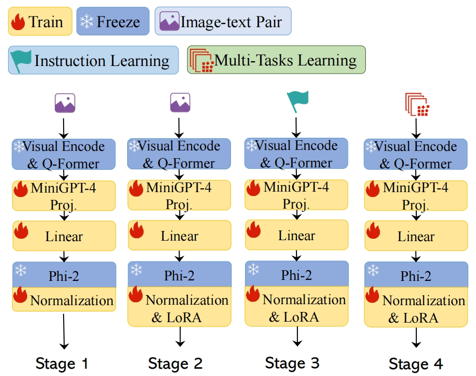
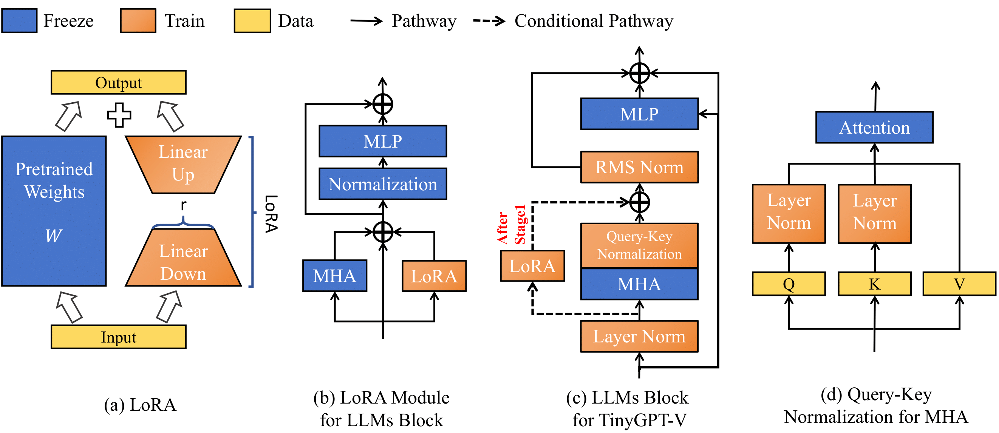

# TinyGPT-V

<font size='5'>**TinyGPT-V: Efficient Multimodal Large Language Model via Small Backbones**</font>

Zhengqing Yuan❁, Zhaoxu Li❁, Lichao Sun❋

❁Visiting Students at LAIR Lab, Lehigh University
❋Lehigh University

</a> <a href='https://arxiv.org/abs/2312.16862'></a>  <a href='https://huggingface.co/Tyrannosaurus/TinyGPT-V'></a> <a href='https://huggingface.co/spaces/llizhx/TinyGPT-V'> 

[English](/README.md) | 简体中文
</font>

## 最新消息
[Jan.03 2024] 我们创建了huggingface demo，试用我们的模型(第三阶段)!

[Dec.28 2023] 我们公开了TinyGPT-V的代码.

## TinyGPT-V 训练过程


## TinyGPT-V 模型结构


## TinyGPT-V 结果


## 准备开始
### 下载

**1. 准备代码和环境**

Git克隆我们的存储库，创建一个python环境，并通过以下命令激活它:

```bash
git clone https://github.com/DLYuanGod/TinyGPT-V.git
cd TinyGPT-V
conda env create -f environment.yml
conda activate tinygptv
```


**2. 准备预训练的LLM权重**

**TinyGPT-V** 基于Phi-2. 
从下面的huggingface空间下载相应的LLM权重通过git-lfs克隆存储库:

Phi-2 2.7B: [Download](https://huggingface.co/susnato/phi-2)


然后，将模型配置文件中的变量*phi_model*设置为LLM权重路径。

* 设置LLM路径 [here](minigpt4/configs/models/minigpt_v2.yaml#L14) 在第14行, [here](minigpt4/configs/models/minigpt4_vicuna0.yaml#L18) 第18行 [here](minigpt4/conversation/conversation.py#L16) 第16行.


**3. 准备预训练的模型权重**

下载预训练的模型权重*

| 阶段1后 | 阶段2后 | 阶段3后 | 阶段4后 | 
| ------ | ------ | ------ | -------|
| [Download](https://huggingface.co/Tyrannosaurus/TinyGPT-V/blob/main/TinyGPT-V_for_Stage1.pth) |[Download](https://huggingface.co/Tyrannosaurus/TinyGPT-V/blob/main/TinyGPT-V_for_Stage2.pth) | [Download](https://huggingface.co/Tyrannosaurus/TinyGPT-V/blob/main/TinyGPT-V_for_Stage3.pth) |[Download](https://huggingface.co/Tyrannosaurus/TinyGPT-V/blob/main/TinyGPT-V_for_Stage4.pth) |


在评估配置文件中给**TinyGPT-V**设置预训练权重的路径

阶段1，2，3：[tinygptv_stage1_2_3_eval.yaml](eval_configs/tinygptv_stage1_2_3_eval.yaml#L8) ，或者阶段4：[tinygptv_stage4_eval.yaml](eval_configs/tinygptv_stage4_eval.yaml#L8) 的第8行.   


**4. 更新transformers库的Phi-2模型.**

Linux系统:

```
cp modeling_phi.py /root/miniconda3/envs/tinygptv/lib/python3.9/site-packages/transformers/models/phi/
```

Windows系统 

找到你自己的: conda_sit/envs/tinygptv/lib/python3.9/site-packages/transformers/models/phi/ 然后用TinyGPT-V/modeling_phi.py 替换 modeling_phi.py .


### 在本地创建demo

对于阶段4, 运行

```
python demo_v2.py --cfg-path eval_configs/tinygptv_stage4_eval.yaml  --gpu-id 0
```

对于阶段1，2，3, 运行
```
python demo.py --cfg-path eval_configs/tinygptv_stage1_2_3_eval.yaml  --gpu-id 0
```


为了使用更强大的模型，LLM默认加载为16位。此配置大约需要8G GPU内存。为了更节省GPU内存，你可以通过在相关配置文件中设置“low_resource”为“True”来以8位在8G以下的设备运行:

* 阶段4 [tinygptv_stage4_eval.yaml](eval_configs/tinygptv_stage4_eval.yaml#6) 

* 阶段1，2，3 [tinygptv_stage1_2_3_eval.yaml](eval_configs/tinygptv_stage1_2_3_eval.yaml#6) 


```diff
-注:第4阶段目前是测试版本，因为它使用部分数据进行训练。请使用第3阶段进行演示。
```

### T训练

首先，您需要调整LLM中所有更新的权重，以便以全精度计算：[Here](minigpt4\models\base_model.py). 删除以下行中的注释:

```
                layer.self_attn.q_layernorm.weight.data = layer.self_attn.q_layernorm.weight.data.float()
                layer.self_attn.k_layernorm.weight.data = layer.self_attn.k_layernorm.weight.data.float()
                layer.post_layernorm.weight.data = layer.post_layernorm.weight.data.float()
                layer.input_layernorm.weight.data = layer.input_layernorm.weight.data.float()

                # Perform a similar operation for the bias item
                if layer.self_attn.q_layernorm.bias is not None:
                    layer.self_attn.q_layernorm.bias.data = layer.self_attn.q_layernorm.bias.data.float()
                if layer.self_attn.k_layernorm.bias is not None:
                    layer.self_attn.k_layernorm.bias.data = layer.self_attn.k_layernorm.bias.data.float()
                if layer.input_layernorm.bias is not None:
                    layer.input_layernorm.bias.data = layer.input_layernorm.bias.data.float()


            llama_model.model.model.final_layernorm.weight.requires_grad = True
            llama_model.model.model.final_layernorm.weight.data = llama_model.model.model.final_layernorm.weight.data.float()
            if llama_model.model.model.final_layernorm.bias is not None:
                llama_model.model.model.final_layernorm.bias.data = llama_model.model.model.final_layernorm.bias.float()
```

**阶段1，2:**

* 数据集: [first stage dataset preparation instruction](https://github.com/Vision-CAIR/MiniGPT-4/blob/main/dataset/README_1_STAGE.md)

* 然后运行:
```
torchrun --nproc-per-node NUM_GPU train.py --cfg-path train_configs/tinygptv_stage1.yaml
```
您需要执行上述代码17次才能完成第一阶段的培训。

* 然后运行:
```
torchrun --nproc-per-node NUM_GPU train.py --cfg-path train_configs/tinygptv_stage2.yaml
```

**阶段3:**

* 数据集: [stage 3 dataset preparation instruction](https://github.com/Vision-CAIR/MiniGPT-4/blob/main/dataset/README_2_STAGE.md)

* 然后运行:
```
torchrun --nproc-per-node NUM_GPU train.py --cfg-path train_configs/tinygptv_stage3.yaml
```

**阶段4:**

* 数据集: [stage 4 dataset preparation instruction](https://github.com/Vision-CAIR/MiniGPT-4/blob/main/dataset/README_MINIGPTv2_FINETUNE.md) 请准备所有数据集除了 COCO captions 和 OCR-VQA.

* 然后运行:
```
torchrun --nproc-per-node NUM_GPU train.py --cfg-path train_configs/tinygptv_stage4.yaml
```

### 评估
查看TinyGPT-V的评估详细信息 [here](eval_scripts/EVAL_README.md)  


## 加🌟历史

[](https://star-history.com/#DLYuanGod/TinyGPT-V&Date)


## 致谢

+ [MiniGPT](https://github.com/Vision-CAIR/MiniGPT-4) 一个非常通用的MLLMs.


如果您在您的研究或应用中使用TinyGPT-V，请使用本BibTeX引用：
```bibtex

@misc{yuan2023tinygptv,
      title={TinyGPT-V: Efficient Multimodal Large Language Model via Small Backbones}, 
      author={Zhengqing Yuan and Zhaoxu Li and Lichao Sun},
      year={2023},
      eprint={2312.16862},
      archivePrefix={arXiv},
      primaryClass={cs.CV}
}
```


## 许可证
该项目开源自 [BSD 3-Clause License](LICENSE.md).
我们的代码基于 [Lavis](https://github.com/salesforce/LAVIS) 与 
BSD 3-Clause 许可证 [here](LICENSE_Lavis.md).